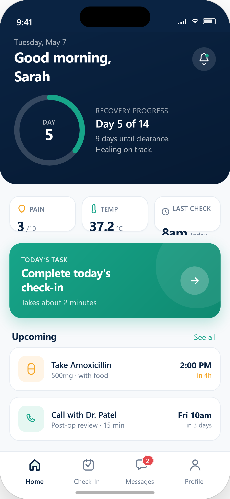
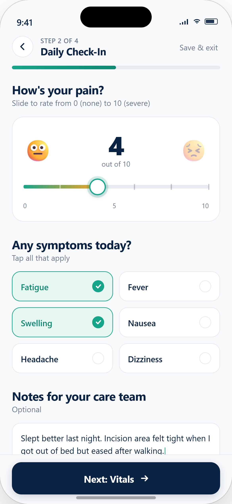
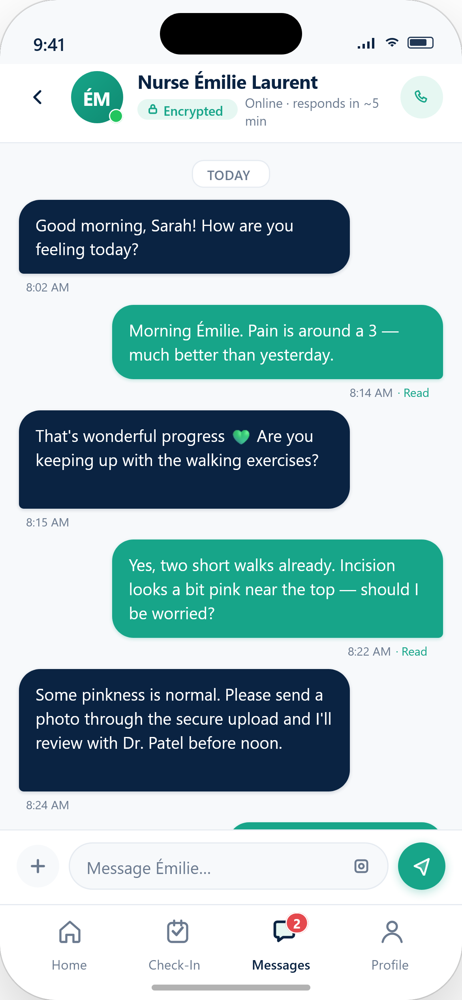
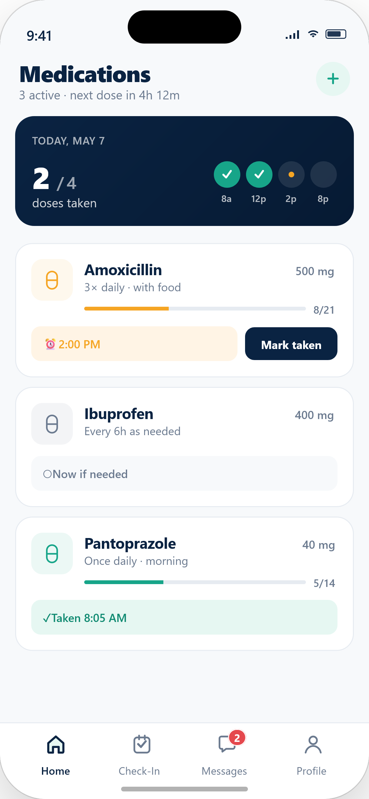
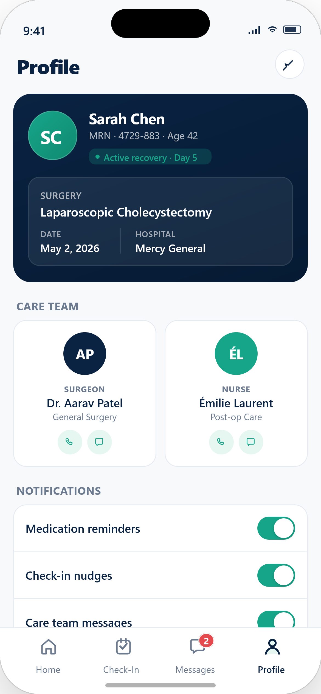
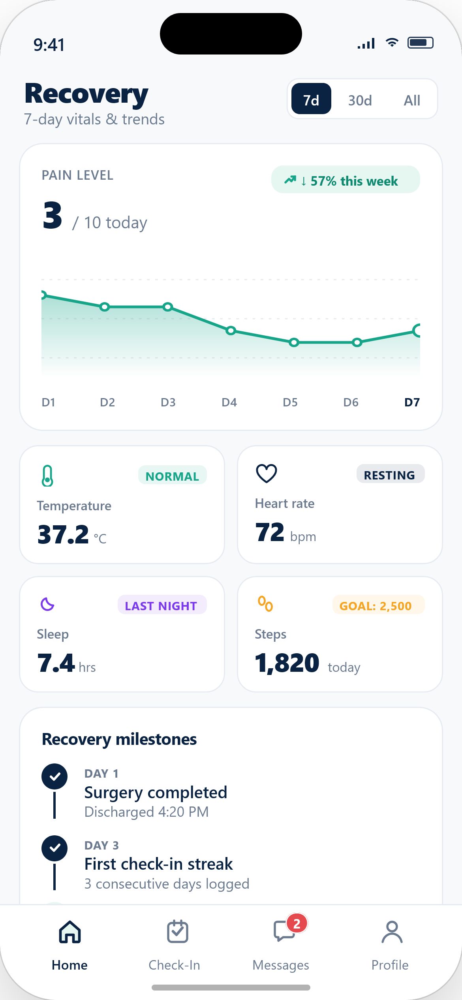
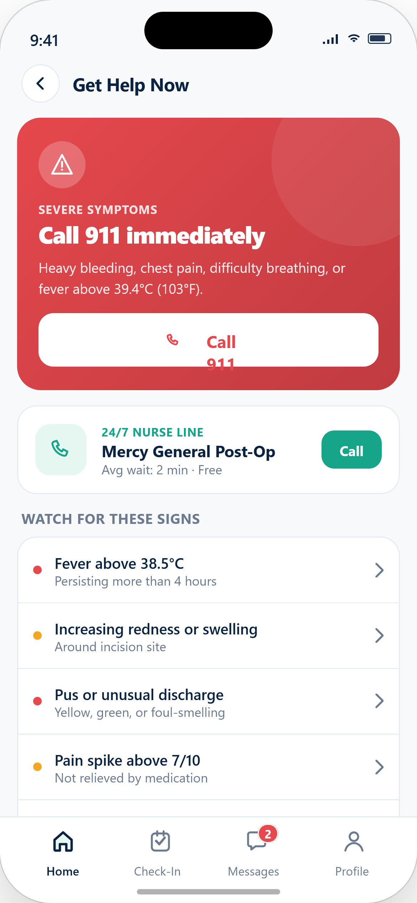
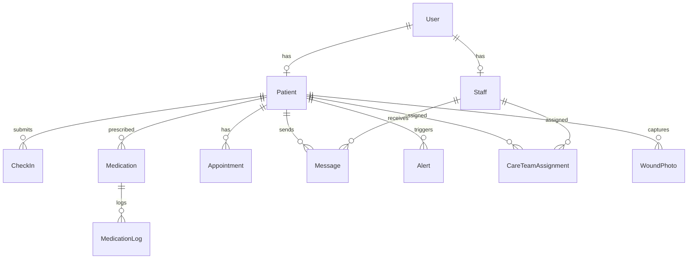

<div align="center">

# 🏥 RecoverCare

**Bridging the gap between surgical discharge and full recovery.**

A hospital-deployed mobile application that turns the post-surgery period — traditionally a blind spot for hospitals — into a continuously monitored, digitally managed care journey.

[](https://reactnative.dev/)
[](https://expo.dev/)
[](https://nodejs.org/)
[](https://postgresql.org/)
[](https://docker.com/)
[](https://typescriptlang.org/)
[](https://prisma.io/)
[](LICENSE)

</div>

---

## 📋 Table of Contents

- [Overview](#-overview)
- [Key Features](#-key-features)
- [Screenshots](#-screenshots)
- [Architecture](#-architecture)
- [Tech Stack](#-tech-stack)
- [Getting Started](#-getting-started)
- [Project Structure](#-project-structure)
- [API Reference](#-api-reference)
- [Alert Engine](#-alert-engine)
- [Database Schema](#-database-schema)

---

## 🌟 Overview

Once a patient leaves the hospital after surgery, **RecoverCare** ensures they are never in a blind spot. The app enables patients to:

- 📊 Submit **daily health check-ins** — reporting pain levels, fever, fatigue, and symptoms through guided forms
- 💬 Communicate via **secure, encrypted two-way messaging** with their assigned nurses and doctors
- 💊 Stay on track with **automated medication and appointment reminders**
- 🚨 Get flagged by an **intelligent alert engine** that detects dangerous symptom combinations and notifies healthcare staff in real-time

On the hospital side, nurses and doctors gain **real-time visibility** into every patient's recovery progress, enabling proactive intervention before situations escalate.

---

## ✨ Key Features

| Feature | Description |
|---------|-------------|
| 🏠 **Recovery Dashboard** | Recovery progress ring, vitals strip, quick actions, milestones, and upcoming tasks at a glance |
| 📋 **Daily Check-In** | 4-step guided form: Mood → Pain & Symptoms → Vitals → Review |
| 💬 **Encrypted Messaging** | Two-way chat with care team, read receipts, online status |
| 💊 **Medication Tracker** | Daily dose schedule, mark-taken, progress bars, PRN support |
| 👤 **Patient Profile** | Full profile editing, surgery info, care team, emergency contacts, medical info |
| 📊 **Recovery Trends** | SVG charts for pain, temperature, mood trends + symptom frequency analysis |
| 📅 **Appointments** | Timeline view, next-appointment hero card, smart icons per type |
| 🔔 **Alerts & Notifications** | View all alert engine outputs with severity filtering and resolution status |
| 📚 **Discharge Resources** | 6-category care guide: wound care, activity, diet, meds, warning signs, FAQ |
| 🎯 **Recovery Milestones** | Achievement cards tracking progress (72h, 1 week, full recovery) |
| 🆘 **Emergency SOS** | One-tap emergency call with 2-step confirmation dialog |
| 🚨 **Smart Alerts** | 4-tier severity engine (Critical/High/Medium/Low) auto-flags dangerous symptoms |
| 🩹 **Wound Photo Journal** | Timeline gallery for daily incision photos with healing status tracking |
| 💡 **Daily Recovery Tips** | Context-aware tips on the home screen, rotating based on recovery day |
| 📖 **Symptom Glossary** | Searchable reference of 15+ post-surgical symptoms with severity and self-care advice |
| 📤 **Health Report** | Shareable recovery summary with vitals timeline, medication adherence, and care team |
| 🌙 **Dark Mode** | System-wide dark theme toggle with AsyncStorage persistence |
| 🔐 **JWT Authentication** | Secure token-based auth with bcrypt password hashing |
| 🐳 **Dockerized Backend** | One-command setup with Docker Compose |
| 🤖 **AI Smart Triage** | NLP-powered sentiment analysis flags urgent messages automatically |
| 📈 **AI Recovery Predictor** | Local ML regression analyzes vitals to predict healing trajectories |

---

## 📱 Screenshots

<div align="center">
<table>
  <tr>
    <td align="center"><b>Home Dashboard</b></td>
    <td align="center"><b>Daily Check-In</b></td>
    <td align="center"><b>Messages</b></td>
  </tr>
  <tr>
    <td></td>
    <td></td>
    <td></td>
  </tr>
  <tr>
    <td align="center"><b>Medications</b></td>
    <td align="center"><b>Profile</b></td>
    <td align="center"><b>Recovery</b></td>
    <td align="center"><b>Emergency</b></td>
  </tr>
  <tr>
    <td></td>
    <td></td>
    <td></td>
    <td></td>
  </tr>
</table>
</div>

---

## 🏗 Architecture

```
┌────────────────────────────────────────────────────────────┐
│                    📱 Mobile App (Expo)                     │
│   React Native · Expo Router · TypeScript · Expo Go        │
│                                                            │
│  ┌──────┐ ┌─────────┐ ┌──────────┐ ┌─────┐ ┌─────────┐   │
│  │ Home │ │Check-In │ │ Messages │ │ Meds│ │ Profile │   │
│  └──┬───┘ └────┬────┘ └────┬─────┘ └──┬──┘ └────┬────┘   │
│     └──────────┼───────────┼──────────┼─────────┘         │
│                │     Axios + JWT      │                    │
└────────────────┼───────────┼──────────┼────────────────────┘
                 │           │          │
                 ▼           ▼          ▼
┌────────────────────────────────────────────────────────────┐
│              ⚙️  Express API Server (:3001)                │
│   Node.js · TypeScript · JWT · Helmet · CORS               │
│                                                            │
│  ┌──────┐ ┌─────────┐ ┌────────┐ ┌──────┐ ┌───────────┐  │
│  │ Auth │ │Patients │ │CheckIns│ │ Msgs │ │   Meds    │  │
│  └──────┘ └─────────┘ └───┬────┘ └──────┘ └───────────┘  │
│                            │                               │
│                    ┌───────▼────────┐                      │
│                    │  Alert Engine  │                      │
│                    │  (4-tier rules)│                      │
│                    └───────┬────────┘                      │
│                            │                               │
│                     Prisma ORM                             │
└────────────────────────────┼───────────────────────────────┘
                             │
                             ▼
┌────────────────────────────────────────────────────────────┐
│              🐘 PostgreSQL 17 (:5432)                      │
│   10 tables · Seeded demo data · Docker volume             │
└────────────────────────────────────────────────────────────┘
```

---

## 🛠 Tech Stack

### Mobile App
| Technology | Purpose |
|-----------|---------|
| **React Native 0.76** | Cross-platform mobile framework |
| **Expo SDK 52** | Managed workflow, OTA updates |
| **Expo Router** | File-based navigation with tabs |
| **TypeScript** | Type safety |
| **Axios** | HTTP client with JWT interceptor |
| **Expo SecureStore** | Encrypted credential storage |
| **React Native SVG** | Recovery progress ring |
| **Expo Linear Gradient** | Premium gradient UI |

### Backend API
| Technology | Purpose |
|-----------|---------|
| **Node.js 22** | Runtime |
| **Express** | REST API framework |
| **Prisma 6** | Type-safe ORM |
| **PostgreSQL 17** | Relational database |
| **JWT (jsonwebtoken)** | Token-based authentication |
| **bcryptjs** | Password hashing |
| **Helmet** | HTTP security headers |
| **natural** | Local NLP & Sentiment Analysis |
| **ml-regression** | Local Machine Learning Regression |
| **Docker Compose** | Container orchestration |

---

## 🚀 Getting Started

### Prerequisites

- **Node.js** 18+ ([download](https://nodejs.org/))
- **Docker Desktop** ([download](https://www.docker.com/products/docker-desktop))
- **Expo Go** app on your phone ([iOS](https://apps.apple.com/app/expo-go/id982107779) / [Android](https://play.google.com/store/apps/details?id=host.exp.exponent))

### 1️⃣ Clone the Repository

```bash
git clone https://github.com/araneeskhan/recover-care.git
cd recover-care
```

### 2️⃣ Set Up Environment Variables

Copy the example environment file and configure it:

```bash
cp .env.example .env
```

Update the values in `.env` as needed (defaults work out of the box for local dev).

### 3️⃣ Start the Backend (Docker)

Make sure Docker Desktop is running, then:

```bash
docker-compose up --build
```

Wait until you see:
```
🏥 RecoverCare API running on port 3001
✅ Seed data created successfully!
```

### 4️⃣ Start the Mobile App

Open a new terminal:

```bash
cd mobile
npm install
npx expo start
```

Scan the QR code with **Expo Go** on your phone.

### 5️⃣ Login

The database is automatically seeded with demo accounts. Check the seed file at `server/prisma/seed.ts` for credentials.

> **📝 Note:** If running on a physical device, the app auto-detects your machine's IP from Expo's dev server. No manual configuration needed!

---

## 📁 Project Structure

```
recover-care/
├── 📱 mobile/                      # Expo React Native App
│   ├── app/
│   │   ├── _layout.tsx             # Root layout (AuthProvider)
│   │   ├── index.tsx               # Entry redirect
│   │   ├── login.tsx               # Login screen
│   │   ├── chat.tsx                # Chat conversation screen
│   │   ├── medications.tsx         # Medications tracker
│   │   ├── wound-journal.tsx       # 🩹 Wound photo timeline
│   │   ├── symptom-glossary.tsx    # 📖 Searchable symptom guide
│   │   ├── health-report.tsx       # 📤 Shareable recovery report
│   │   └── (tabs)/
│   │       ├── _layout.tsx         # Tab navigator (4 tabs)
│   │       ├── index.tsx           # 🏠 Home dashboard
│   │       ├── checkin.tsx         # 📋 Daily check-in form
│   │       ├── messages.tsx        # 💬 Conversations list
│   │       └── profile.tsx         # 👤 Patient profile
│   ├── constants/
│   │   └── Colors.ts               # 🎨 Design system tokens
│   ├── hooks/
│   │   └── useAuth.tsx             # 🔐 Auth context provider
│   ├── services/
│   │   └── api.ts                  # 🔗 Axios API client
│   ├── app.json                    # Expo configuration
│   └── package.json
│
├── ⚙️ server/                       # Express API Backend
│   ├── src/
│   │   ├── index.ts                # Server entry point
│   │   ├── middleware/
│   │   │   └── auth.ts             # JWT authentication
│   │   ├── routes/
│   │   │   ├── auth.ts             # Login / Register
│   │   │   ├── patients.ts         # Profile & Dashboard
│   │   │   ├── checkins.ts         # Daily check-ins
│   │   │   ├── messages.ts         # Messaging
│   │   │   ├── medications.ts      # Medication tracking
│   │   │   ├── appointments.ts     # Appointments
│   │   │   └── wound-photos.ts     # 🩹 Wound photo journal
│   │   └── services/
│   │       └── alertEngine.ts      # 🚨 Intelligent alert rules
│   ├── prisma/
│   │   ├── schema.prisma           # Database schema (10 models)
│   │   └── seed.ts                 # Demo data seeder
│   ├── Dockerfile
│   └── package.json
│
├── docker-compose.yml              # 🐳 PostgreSQL + API orchestration
├── .env                            # Environment variables (not in repo)
└── README.md
```

---

## 📡 API Reference

All endpoints are prefixed with `/api`. Protected routes require `Authorization: Bearer <token>`.

### Authentication
| Method | Endpoint | Description | Auth |
|--------|----------|-------------|------|
| `POST` | `/auth/login` | Authenticate user, returns JWT | ❌ |
| `POST` | `/auth/register` | Create new account | ❌ |

### Patient
| Method | Endpoint | Description | Auth |
|--------|----------|-------------|------|
| `GET` | `/patients/me` | Get patient profile + care team | ✅ |
| `GET` | `/patients/me/dashboard` | Home screen aggregated data | ✅ |

### Check-Ins
| Method | Endpoint | Description | Auth |
|--------|----------|-------------|------|
| `POST` | `/checkins` | Submit daily check-in (triggers alerts) | ✅ |
| `GET` | `/checkins` | Get check-in history | ✅ |
| `GET` | `/checkins/latest` | Get most recent check-in | ✅ |

### Messages
| Method | Endpoint | Description | Auth |
|--------|----------|-------------|------|
| `GET` | `/messages/conversations` | List all conversations | ✅ |
| `GET` | `/messages/:staffId` | Get messages in a thread | ✅ |
| `POST` | `/messages` | Send a message | ✅ |

### Medications
| Method | Endpoint | Description | Auth |
|--------|----------|-------------|------|
| `GET` | `/medications` | Get all medications + logs | ✅ |
| `POST` | `/medications/:id/take` | Mark medication as taken | ✅ |
| `GET` | `/medications/schedule` | Today's medication schedule | ✅ |

### Appointments
| Method | Endpoint | Description | Auth |
|--------|----------|-------------|------|
| `GET` | `/appointments` | Get upcoming appointments | ✅ |

### Health
| Method | Endpoint | Description | Auth |
|--------|----------|-------------|------|
| `GET` | `/health` | API health check | ❌ |

---

## 🚨 Alert Engine

The intelligent alert system evaluates every check-in submission against clinical rules:

| Severity | Trigger Condition | Response |
|----------|-------------------|----------|
| 🔴 **CRITICAL** | Pain ≥ 8 **AND** fever > 38.5°C | Immediate staff notification — possible post-surgical infection |
| 🟠 **HIGH** | Pain ≥ 8 **OR** fever > 38.5°C **OR** (fever > 38°C + pain ≥ 6) | Priority clinical review |
| 🟡 **MEDIUM** | 3+ symptoms reported **OR** pain spike ≥ 3 from previous check-in | Increased monitoring recommended |
| 🔵 **LOW** | Dizziness + Nausea combination | Possible medication side effect — review at next check-in |

---

## 🗄 Database Schema

The app uses **11 relational tables** managed by Prisma ORM. See `server/prisma/schema.prisma` for full details.



---

<div align="center">

**Built with ❤️ for better post-surgical care**

*RecoverCare — Your recovery, continuously monitored.*

</div>
